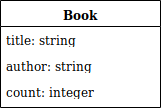

# Introduction to Ruby on Rails
This is the reference document used in the "Introduction to Ruby on Rails" Hackerschool workshop AY19/20 Semester 1.

Made by Herbert Ilhan Tanujaya, for NUS Hackers.

## Preparation
- Linux/Mac. Windows is not recommended. Please consult a helper if you are using Windows.
- RVM: https://rvm.io/
  - `gpg2 --recv-keys 409B6B1796C275462A1703113804BB82D39DC0E3 7D2BAF1CF37B13E2069D6956105BD0E739499BDB`
  - `\curl -sSL https://get.rvm.io | bash -s stable --rails`

### Check
`ruby -v` returns
```
ruby 2.6.3p62 (2019-04-16 revision 67580) [x86_64-linux]
```
(OK as long as it’s Ruby 2.6)

`rails -v` returns
```
Rails 6.0.0
```

## The Model-View-Controller Framework
Rails applications are structured with the Model-View-Controller (MVC) framework.
_This is very important!_ You really need to understand this MVC framework
before you can understand Ruby on Rails.

### The Three Components
- Model: the objects that is central to the application
- Controller: actions you can do on the model
- View: the interface the user sees

In general, the model stands by itself, and the controller and the view are
linked together.

The controller and the view acts upon a model. One model can have many
controller actions / views.

### Using Reddit as a Sample

## Creating a Book Shop App
```
rails new book-shop
```
will create a bunch of files, and install things.

Afterwards, you can `cd book-shop`
```
$ ls
app  babel.config.js  bin  config  config.ru  db  Gemfile  Gemfile.lock  lib
log  node_modules  package.json  postcss.config.js  public  Rakefile  README.md
storage  test  tmp  vendor  yarn.lock
```

### Checking that the App is Created
```
$ rails server
=> Booting Puma
=> Rails 6.0.0 application starting in development 
=> Run `rails server --help` for more startup options
Puma starting in single mode...
* Version 3.12.1 (ruby 2.6.3-p62), codename: Llamas in Pajamas
* Min threads: 5, max threads: 5
* Environment: development
* Listening on tcp://localhost:3000
Use Ctrl-C to stop
```

Open `localhost:3000` in your browser. You should see "Yay! You're on Rails!"

## Defining our Requirements and Model
- The book store contains books.
- Every book has a title, an author, and a book count (number of books remaining).
- Everyone can view a listing of all books, as well as a single book itself.
- For now, let us assume everyone can create, update, and delete books as well.
- Everyone can "purchase" a book, reducing its count by 1. You cannot purchase
  if the book count is zero.


## Creating our Model
```
$ rails generate model Book title:string author:string count:integer
Running via Spring preloader in process 16753
      invoke  active_record
      create    db/migrate/20190728121953_create_books.rb
      create    app/models/book.rb
      invoke    test_unit
      create      test/models/book_test.rb
      create      test/fixtures/books.yml
```

Then `app/models/book.rb` should contain:
```ruby
class Book < ApplicationRecord
end
```

## Running a Database Migration
```
$ rails db:migrate
== 20190728123042 CreateBooks: migrating ======================================
-- create_table(:books)
   -> 0.0010s
== 20190728123042 CreateBooks: migrated (0.0011s) =============================
```

## Manipulating the Models through the Rails Console
```
$ rails console
Running via Spring preloader in process 30584
Loading development environment (Rails 6.0.0)
irb(main):001:0>
```

You can type Ruby on it.
```ruby
irb(main):001:0> 1234 + 5678
=> 6912
irb(main):002:0> 'xa' * 7
=> "xaxaxaxaxaxaxa"
```

### Creating Books
```ruby
irb(main):001:0> book = Book.new()
   (0.3ms)  SELECT sqlite_version(*)
=> #<Book id: nil, title: nil, author: nil, count: nil, created_at: nil, updated_at: nil>
irb(main):002:0> book.title = 'Introduction to Algorithms'
=> "Introduction to Algorithms"
irb(main):003:0> book.author = 'Cormen, Leiserson, Rivest, Stein'
=> "Cormen, Leiserson, Rivest, Stein"
irb(main):004:0> book.count = 100
=> 100
irb(main):005:0> book.save()
   (0.2ms)  begin transaction
  Book Create (0.6ms)  INSERT INTO "books" ("title", "author", "count",
  "created_at", "updated_at") VALUES (?, ?, ?, ?, ?)  [["title", "Introduction
  to Algorithms"], ["author", "Cormen, Leiserson, Rivest, Stein"], ["count",
  100], ["created_at", "2019-09-13 08:12:49.508990"], ["updated_at",
  "2019-09-13 08:12:49.508990"]]
   (13.8ms)  commit transaction
=> true
```

`Book Create` indicates that books are being inserted to the database.

Information can also be supplied to the `new` method:
```ruby
irb(main):006:0> gatsby = Book.new(title: 'The Great Gatsby', author: 'Fitzgerald', count: 20)
=> #<Book id: nil, title: "The Great Gatsby", author: "Fitzgerald", count: 20,
created_at: nil, updated_at: nil>
irb(main):007:0> gatsby.save()
   (0.1ms)  begin transaction
  Book Create (0.6ms)  INSERT INTO "books" ("title", "author", "count", "created_at",
  "updated_at") VALUES (?, ?, ?, ?, ?)  [["title", "The Great Gatsby"],
  ["author", "Fitzgerald"], ["count", 20], ["created_at", "2019-07-28 12:37:02.850518"],
  ["updated_at", "2019-07-28 12:37:02.850518"]]
   (8.0ms)  commit transaction
=> true
```

Or do it in one shot with the `create` method:
```ruby
irb(main):008:0> Book.create(title: 'Guns, Germs, and Steel', author: 'Diamond', count: 20)
   (0.1ms)  begin transaction
  Book Create (0.6ms)  INSERT INTO "books" ("title", "author", "count", "created_at",
  "updated_at") VALUES (?, ?, ?, ?, ?)  [["title", "Guns, Germs, and Steel"],
  ["author", "Diamond"], ["count", 20], ["created_at", "2019-07-28 12:37:32.049849"],
  ["updated_at", "2019-07-28 12:37:32.049849"]]
   (10.3ms)  commit transaction
=> #<Book id: 3, title: "Guns, Germs, and Steel", author: "Diamond", count: 20,
created_at: "2019-07-28 12:37:32", updated_at: "2019-07-28 12:37:32">
```

### Getting Information on Books

#### Viewing All Books
```ruby
irb(main):001:0> Book.all()
  Book Load (0.5ms)  SELECT  "books".* FROM "books" LIMIT ?  [["LIMIT", 11]]
=> #<ActiveRecord::Relation [#<Book id: 1, title: "Introduction to Algorithms",
author: "Cormen, Leiserson, Rivest, Stein", count: 100, created_at: "2019-07-28 12:35:08",
updated_at: "2019-07-28 12:35:08">, #<Book id: 2, title: "The Great Gatsby",
author: "Fitzgerald", count: 20, created_at: "2019-07-28 12:37:02",
updated_at: "2019-07-28 12:37:02">, #<Book id: 3, title: "Guns, Germs, and Steel",
author: "Diamond", count: 20, created_at: "2019-07-28 12:37:32",
updated_at: "2019-07-28 12:41:08">]>
```

#### Getting a Subset of Books
```ruby
irb(main):002:0> Book.where(title: 'Introduction to Algorithms')
  Book Load (0.5ms)  SELECT  "books".* FROM "books" WHERE "books"."title" = ?
  LIMIT ?  [["title", "Introduction to Algorithms"], ["LIMIT", 11]]
=> #<ActiveRecord::Relation [#<Book id: 1, title: "Introduction to Algorithms",
author: "Cormen, Leiserson, Rivest, Stein", count: 100, created_at: "2019-07-28
12:35:08", updated_at: "2019-07-28 12:35:08">]>
irb(main):003:0> Book.where(title: 'No title')
  Book Load (0.3ms)  SELECT  "books".* FROM "books" WHERE "books"."title" = ?
  LIMIT ?  [["title", "No title"], ["LIMIT", 11]]
=> #<ActiveRecord::Relation []>
irb(main):004:0> Book.where(count: 20)
  Book Load (0.4ms)  SELECT  "books".* FROM "books" WHERE "books"."count" = ?
  LIMIT ?  [["count", 20], ["LIMIT", 11]]
=> #<ActiveRecord::Relation [#<Book id: 2, title: "The Great Gatsby", author:
"Fitzgerald", count: 20, created_at: "2019-07-28 12:37:02", updated_at:
"2019-07-28 12:37:02">, #<Book id: 3, title: "Guns, Germs, and Steel", author:
"Diamond", count: 20, created_at: "2019-07-28 12:37:32", updated_at:
"2019-07-28 12:41:08">]>
```

#### Getting a specific book
```ruby
irb(main):005:0> Book.find_by(author: 'Diamond')
  Book Load (0.4ms)  SELECT  "books".* FROM "books" WHERE "books"."author" = ?
  LIMIT ?  [["author", "Diamond"], ["LIMIT", 1]]
=> #<Book id: 3, title: "Guns, Germs, and Steel", author: "Diamond", count: 20,
created_at: "2019-07-28 12:37:32", updated_at: "2019-07-28 12:41:08">
irb(main):006:0> Book.find_by(count: 20)
  Book Load (0.3ms)  SELECT  "books".* FROM "books" WHERE "books"."count" = ?
  LIMIT ?  [["count", 20], ["LIMIT", 1]]
=> #<Book id: 2, title: "The Great Gatsby", author: "Fitzgerald", count: 20,
created_at: "2019-07-28 12:37:02", updated_at: "2019-07-28 12:37:02">
```

### Manipulating Books
```ruby
irb(main):008:0> gatsby = Book.find_by(title: 'The Great Gatsby')
  Book Load (0.3ms)  SELECT  "books".* FROM "books" WHERE "books"."title" = ?
  LIMIT ?  [["title", "The Great Gatsby"], ["LIMIT", 1]]
=> #<Book id: 2, title: "The Great Gatsby", author: "Fitzgerald", count: 20,
created_at: "2019-07-28 12:37:02", updated_at: "2019-07-28 12:37:02">
irb(main):009:0> gatsby.count = 15
=> 15
irb(main):010:0> gatsby.save()
   (0.2ms)  begin transaction
  Book Update (0.4ms)  UPDATE "books" SET "count" = ?, "updated_at" = ? WHERE
  "books"."id" = ?  [["count", 15], ["updated_at", "2019-07-28
  12:43:12.771246"], ["id", 2]]
   (11.0ms)  commit transaction
=> true
```

Alternatively, do it in one shot with the `update` method:
```ruby
irb(main):011:0> gatsby.update(count: 10)
   (0.1ms)  begin transaction
  Book Update (0.6ms)  UPDATE "books" SET "count" = ?, "updated_at" = ? WHERE
  "books"."id" = ?  [["count", 10], ["updated_at", "2019-07-28
  12:44:15.082445"], ["id", 2]]
   (10.5ms)  commit transaction
=> true
```

### Deleting Books
```ruby
irb(main):012:0> gatsby.destroy()
   (0.1ms)  begin transaction
  Book Destroy (0.4ms)  DELETE FROM "books" WHERE "books"."id" = ?  [["id", 2]]
   (8.0ms)  commit transaction
=> #<Book id: 2, title: "The Great Gatsby", author: "Fitzgerald", count: 10,
created_at: "2019-07-28 12:37:02", updated_at: "2019-07-28 12:44:15">
irb(main):013:0> Book.all()
  Book Load (0.3ms)  SELECT  "books".* FROM "books" LIMIT ?  [["LIMIT", 11]]
=> #<ActiveRecord::Relation [#<Book id: 1, title: "Introduction to Algorithms",
author: "Cormen, Leiserson, Rivest, Stein", count: 100, created_at: "2019-07-28
12:35:08", updated_at: "2019-07-28 12:35:08">, #<Book id: 3, title: "Guns,
Germs, and Steel", author: "Diamond", count: 20, created_at: "2019-07-28
12:37:32", updated_at: "2019-07-28 12:41:08">]>
```

## Adding Controllers and Views
Notice the _plural_ Books!
```
$ rails generate controller Books
Running via Spring preloader in process 16928
      create  app/controllers/books_controller.rb
      invoke  erb
      create    app/views/books
      invoke  test_unit
      create    test/controllers/books_controller_test.rb
      invoke  helper
      create    app/helpers/books_helper.rb
      invoke    test_unit
      invoke  assets
      invoke    scss
      create      app/assets/stylesheets/books.scss
```
Let us do all of CRUD: Create, Read, Update, and Delete.

### List
Change `app/controllers/books_controller.rb` to:
```ruby
class BooksController < ApplicationController
  def list
    @books = Book.all()
  end
end
```

Let's create a view that corresponds to this `list` controller. In `app/views/books/list.html.erb`:
```erb
<% @books.each do |book| %>
  <p>ID: <%= book.id %>, title: <%= book.title %>, author: <%= book.author %>,
  count: <%= book.count %></p>
<% end %>
```

Let us make this page accessible from the web. In `config/routes.rb`:
```ruby
Rails.application.routes.draw do
  get('books', to: 'books#list')
end
```

Now, if you run `rails server` and open `localhost:3000/books/` you should be
able to see the list of all books.

#### What is actually happening?
- `@books` defined in the controller is shared to the view
- `.each do |book|` is like a for-loop for Ruby that iterates through the
  `@books` array
- `<% ... %>` is a ERB tag. `<%= ... %>` is also an ERB tag, but it evaluates
  it and prints it to the HTML.
- `get('books', to: 'books#list')` points `/books` to the `Books` controller,
  `list` method

You can try these things:
- Change `@books` to e.g. `Book.where(author: 'Diamond')`
- Change `@books` to `books`, without the at sign
- Make your views easier to read, maybe by adding line breaks, or even with tables
- Change your route definition to maybe `get('aaa', ...)` or something

### Show
Add this `show` method to `app/controllers/books_controller.rb`:
```ruby
def show
  id = params[:id]
  @book = Book.find_by(id: id)
end
```

In `app/views/books/show.html.erb`:
```erb
<p>Title: <%= @book.title %><p>
<p>Author: <%= @book.author %><p>
<p>Count: <%= @book.count %><p>
```

In `config/routes.rb`:
```ruby
get('books/:id', to: 'books#show')
```

Then open e.g. `localhost:3000/books/1`. You should be able to see your book.

#### What is actually happening?
- By defining the routes to `books/:id`, we "capture" the `:id` parameter.
- `params[:id]` accesses that parameter in the controller.
- `:id` is what we call a symbol. Just assume that it is a string.

### Create
We need `new` and `create`.
- `new` is when you get the form for people to fill in book information
- `create` is when you actually submit the form to create the object

#### New action
In the controller:
```ruby
def new
  @book = Book.new()
end
```

In `app/views/book/new.html.erb`:
```erb
<%= form_with(model: @book, local: true) do |form| %>
  <p>
    <%= form.label(:title) %><br>
    <%= form.text_field(:title) %>
  </p>

  <p>
    <%= form.label(:author) %><br>
    <%= form.text_field(:author) %>
  </p>

  <p>
    <%= form.label(:count) %><br>
    <%= form.text_field(:count) %>
  </p>

  <p>
    <%= form.submit() %>
  </p>
<% end %>
```

In the routes:
```ruby
Rails.application.routes.draw do
  get('books/new', to: 'books#new')
  get('books', to: 'books#list')
  get('books/:id', to: 'books#show')
end
```
Make sure that `books/new` is before `books/:id`, so that it has higher priority!

Now visit `localhost:3000/books/new`.

##### What is actually happening?
- Again, with the `books/new` routes defined to `books#new`, it goes into the
  `new` action.
- `form_with` is a form _helper_. It is a Rails specific function that helps
  you generate forms. Inspect the HTML to see what is actually being generated.
  You pass in a model, in this case `@book`.
- You can pass in a Ruby _block_ that shows how the HTML is being generated.
  This block takes in `form`, and you can access objects from the form's
  attributes.

#### Adding link to new book
In the list view, add:
```erb
<%= link_to('New book', books_new_path) %>
```

##### What is actually happening?
- `books_new_path` is automatically defined by Rails:
```
$ rails routes
   Prefix Verb URI Pattern          Controller#Action
books_new GET  /books/new(.:format) books#new
    books GET  /books(.:format)     books#list
          GET  /books/:id(.:format) books#show
...
```
You need to append `_path` to the "Prefix" column to get your paths. Tip:
Rails's error pages also show this helpful table. Try e.g. `localhost:3000/asdf`.
- `link_to` is a helper function provided by Rails.

#### Create action
In the controller:
```ruby
def create
  book_params = params[:book]
  book = Book.new(book_params())

  if book.save()
    redirect_to(books_path)
  else
    redirect_to(books_new_path)
  end
end

private
def book_params
  params.require(:book).permit(:title, :author, :count)
end
```

In the routes:
```ruby
Rails.application.routes.draw do
  get('books/new', to: 'books#new')
  post('books', to: 'books#create')
  get('books', to: 'books#list')
  get('books/:id', to: 'books#show')
end
```

Now you can create a book!

##### What is actually happening?
A lot is happening here.

- Let us disect the method `book_params`. It takes `params`, which behaves like
  a hash (dictionary in Python / `HashMap` in Java / `unordered_map` in C++).
  `require` requires `params` to contain a `:book`.
- In the `:book` key, it is another hash. We only extract `:title`, `:author`,
  and `:count` out.
- `redirect_to` redirects your browser to another path.
- `books_path` and `books_new_path` is automatically defined by Rails:
```
$ rails routes
   Prefix Verb URI Pattern          Controller#Action
books_new GET  /books/new(.:format) books#new
    books GET  /books(.:format)     books#list
          GET  /books/:id(.:format) books#show
...
```
- We use `book` instead of `@book`, since we do not have anything to share with
  the views. In fact, we do not have any view associated with the `edit` action.
- We do not have any views, since we always redirect somewhere.
- `post` in the routes, indicates a POST request. This is different from typical
  requests your browser makes, which is GET.

You can try these things:
- `puts(params)`, `puts(book_params())`, and `puts(book)` on the controller

##### How HTTP requests work
Refer to https://developer.mozilla.org/en-US/docs/Web/HTTP/Overview#HTTP_flow.

A request contains the method and the path, and you get some response back.
Typically, in a static site, you only give back HTML and CSS. Rails controls
what is being sent given a request. In this case we are actually using Puma
as our web server.

### Edit
Just like `new` and `create`, we need `edit` and `update`.
- `edit` is when you get the form for people to edit book information
- `update` is when you actually submit the form to change the object

#### Controller
```ruby
def edit
  id = params[:id]
  @book = Book.find_by(id: id)
end

def update
  id = params[:id]
  book = Book.find_by(id: id)

  if book.update(book_params())
    redirect_to(books_path)
  else
    redirect_to(books_edit_path)
  end
end
```

#### View
`app/views/books/edit.html.erb`:
```erb
<%= form_with(model: @book, local: true) do |form| %>
  <p>
    <%= form.label(:title) %><br>
    <%= form.text_field(:title) %>
  </p>

  <p>
    <%= form.label(:author) %><br>
    <%= form.text_field(:author) %>
  </p>

  <p>
    <%= form.label(:count) %><br>
    <%= form.text_field(:count) %>
  </p>

  <p>
    <%= form.submit() %>
  </p>
<% end %>
```

#### Routes
```ruby
Rails.application.routes.draw do
  get('books/new', to: 'books#new')
  post('books', to: 'books#create')
  get('books/:id/edit', to: 'books#edit', as: 'book')
  put('books/:id', to: 'books#update', as: 'book')
  get('books', to: 'books#list')
  get('books/:id', to: 'books#show')
end
```

### Delete

#### Controller
```ruby
def destroy
  id = params[:id]
  Book.find_by(id: id).destroy()
end
```

#### Routes
```ruby
Rails.application.routes.draw do
  get('books/new', to: 'books#new')
  post('books', to: 'books#create')
  delete('books/:id', to: 'books#destroy')
  get('books/:id/edit', to: 'books#edit')
  put('books/:id', to: 'books#update')
  get('books', to: 'books#list')
  get('books/:id', to: 'books#show')
end
```

## More!
In general, you can refer to https://guides.rubyonrails.org/getting_started.html.
It can be somewhat overwhelming, but it is up to date.

### Using routes resources
Replace `config/routes.rb` with
```ruby
Rails.application.routes.draw do
  resources(:books)
end
```

### Adding CSS
Check out `app/assets/stylesheets/books.scss`. SCSS is like CSS but better:
https://sass-lang.com/

Let us try to put this in that file: (courtesy of https://blog.koley.in/2019/339-bytes-of-responsive-css)
```css
@import url('https://fonts.googleapis.com/css?family=Fira+Sans:300');
body {
  font-family: 'Fira Sans', sans-serif;
  line-height: 1.6;
  color: #222;
  max-width: 40rem;
  padding: 2rem;
  margin: auto;
  background: #fafafa;
}
```

In reality, you might want to create a new file for this application-wide style.
Try to put only books-related styles in the `books.scss` file.

### Model Validation
Let us change `app/models/book.rb`:
```ruby
class Book < ApplicationRecord
  validates(:count, numericality: { greater_than_or_equal_to: 0 })
end
```

Now you cannot set count to be negative:
```
irb(main):001:0> Book.find_by(id: 1).update(count: -3)
  Book Load (0.2ms)  SELECT  "books".* FROM "books" WHERE "books"."id" = ?
  LIMIT ?  [["id", 1], ["LIMIT", 1]]
   (0.0ms)  begin transaction
   (0.0ms)  rollback transaction
=> false
```
Notice the "rollback transaction" (instead of the normal "commit transaction"),
and that it returns `false` instead of `true`.

### Beyond: Convention over Configuration
"Not everyone is a special snowflake." Rails prefers doing things
implicitly/magically over explicitness.

## Appendix: Idiomatic Ruby
- In general, parantheses on function calls can be omitted
- The last value of a function in Ruby serves as a return value
- Think of a block as a function
